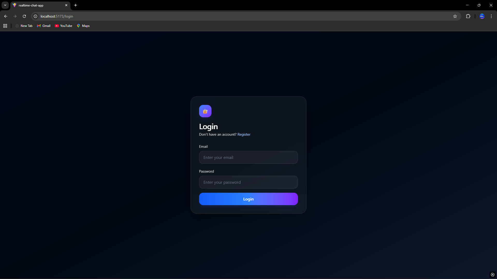
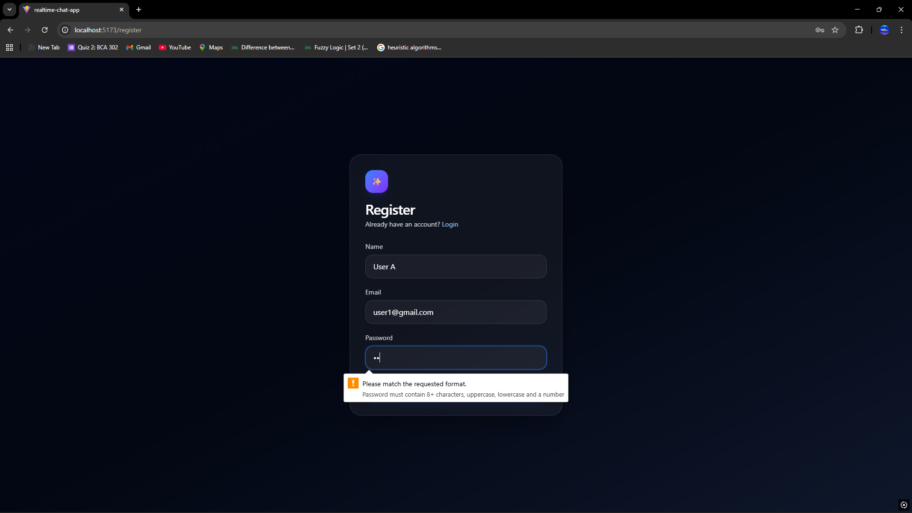
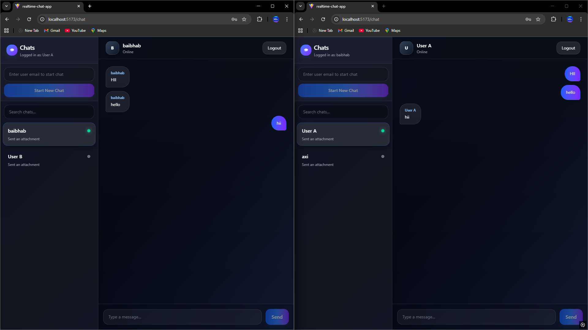

# 🚀 Real-Time Chat Application


A full-stack **real-time chat application** built using modern technologies with instant messaging, authentication, and live user interaction powered by Socket.io.

---

## 🌐 Live Demo

🚧 Not deployed yet

---

## ✨ Features

* 🔐 JWT Authentication (Login & Register)
* 💬 Real-time messaging using Socket.io
* 👥 One-to-one chat system
* 🟢 Online user presence
* ✍️ Typing indicator
* 📡 Instant message updates (no refresh)
* 🔄 Persistent chat history (MongoDB)

---

## 🛠️ Tech Stack

### 🎨 Frontend

* React.js (Vite)
* Tailwind CSS

### ⚙️ Backend

* Node.js
* Express.js

### 🗄️ Database

* MongoDB

### 🔌 Realtime Engine

* Socket.io

---

## 📸 Screenshots

### 🔐 Login Page



### 📝 Register Page



### 💬 Chat Interface



---

## 📁 Project Structure

```
realtime-chat-app/
│
├── Client/        # React frontend
├── Server/        # Express backend
│   ├── routes/
│   ├── controllers/
│   ├── models/
│   ├── middleware/
│
└── README.md
```

---

## ⚙️ Installation & Setup

### 1️⃣ Clone Repository

```bash
git clone https://github.com/Baibhab-Bagchi/realtime-chat-app.git
cd realtime-chat-app
```

---

### 2️⃣ Setup Backend

```bash
cd Server
npm install
```

Create `.env` file in Server folder:

```
MONGO_URI=your_mongodb_connection_string
JWT_SECRET=your_secret_key
CLIENT_URL=http://localhost:5173
```

Run backend:

```bash
npm run dev
```

---

### 3️⃣ Setup Frontend

```bash
cd Client
npm install
npm run dev
```

---

## 🚀 Future Improvements

* 🌐 Deploy app (Render / Vercel)
* 📱 Mobile responsiveness enhancements
* 👥 Group chat feature
* 📁 File sharing support
* 🔔 Notifications system

---

## 👨‍💻 Author

**Baibhab Bagchi**

* 💼 Aspiring Full Stack Developer
* 🔗 GitHub: https://github.com/Baibhab-Bagchi

---

## ⭐ Show Your Support

If you like this project, consider giving it a ⭐ on GitHub!
